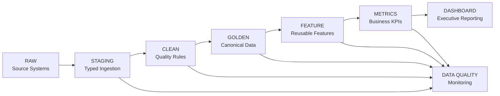

# Production Analytics Architecture

## Collections Analytics Assignment

---

## 1. Architecture Overview

The proposed production analytics system converts raw collections data into a trusted analytical layer and then into standardized business metrics and an executive dashboard.

The architecture follows:

**Raw → Staging → Clean → Golden → Feature → Metrics → Dashboard**

Data quality monitoring and audit controls operate across the pipeline.



---

## 2. Source Systems

The Raw layer contains data from multiple operational systems:

- Borrowers
- Accounts
- Agents
- Agent Sessions
- Campaigns
- Daily Targeting
- Calls
- Call Attempts
- Call Dispositions
- WhatsApp Events
- SMS Events
- Field Visits
- Promises to Pay
- Payments
- Vendor Telephony
- Complaints
- Account Status History

The Raw layer is immutable.

Source data should be preserved exactly as received so historical reprocessing, audits, and backfills remain possible.

---

## 3. Staging Layer

The Staging layer converts source files into structured, typed tables.

The current repository contains:

`sql/01_staging.sql`

### Type Casting Examples

- `amount` → NUMERIC
- `dpd` → INTEGER
- `event_at` → TIMESTAMP
- `opened_at` → TIMESTAMP
- `joined_at` → TIMESTAMP

### Responsibilities

- Source ingestion
- Schema validation
- Type validation
- Basic completeness checks
- Source metadata capture
- Preservation of source identifiers

---

## 4. Clean Layer

The Clean layer applies the data-quality rules identified during forensic analysis.

The current repository contains:

`sql/02_cleaning.sql`

### Borrowers

Canonical identifier:

`borrower_id`

Rules:

- Retain one canonical record per borrower ID
- Prefer the latest updated profile
- Preserve identity-conflict flags

### Accounts

Canonical identifier:

`account_id`

Rules:

- Retain the account record
- Validate borrower relationships
- Flag missing borrower IDs
- Flag unresolved borrower relationships

### Agents

Canonical identifier:

`agent_id`

Rules:

- Resolve repeated agent records
- Retain the latest updated profile
- Preserve agent identity issues

### Calls

Canonical identifier:

`call_id`

Rules:

- Remove exact duplicate event rows
- Preserve missing agent IDs as explicit exceptions
- Validate timestamps
- Validate account relationships

### Payments

Canonical identifier:

`payment_id`

Rules:

- Identify repeated payment IDs
- Prefer the most complete duplicate record
- Retain one canonical payment event
- Validate payment status and amount

---

## 5. Golden Layer

The Golden layer is the canonical analytical source of truth.

The current repository contains:

`sql/03_golden.sql`

Core Golden datasets:

| Entity | Golden Rows | Core Dataset |
|---|---:|---|
| Borrowers | 11,015 | `golden_borrowers` |
| Accounts | 30,000 | `golden_accounts` |
| Agents | 1,000 | `golden_agents` |
| Calls | 90,079 | `golden_calls` |
| Payments | 25,000 | `golden_payments` |

Golden data must remain:

- Canonical
- Reproducible
- Auditable
- Stable for downstream analytics

Raw data remains available for audit and replay.

---

## 6. Data Contracts and Primary Keys

| Entity | Primary Key | Main Integrity Checks |
|---|---|---|
| Borrower | `borrower_id` | Not null, identity conflicts |
| Account | `account_id` | Unique, not null, borrower linkage |
| Agent | `agent_id` | Unique, profile consistency |
| Call | `call_id` | Duplicate checks, timestamp validity |
| Payment | `payment_id` | Duplicate checks, amount/status validity |

Referential integrity is monitored for:

- Account → Borrower
- Payment → Account
- Call → Account
- Call → Agent

Missing or unresolved relationships are retained as quality exceptions rather than silently fabricated.

---

## 7. Feature Layer

The Feature layer creates reusable analytical attributes.

### Portfolio Features

- `risk_segment`
- `loan_type`
- `dpd`
- `outstanding_amount`
- `principal_amount`
- `status`

### Collection Features

- `call_count`
- `answered_call_count`
- `attempt_count`
- `contact_rate`
- `attempts_per_account`
- `last_call_at`
- `days_since_last_call`

### Digital Features

- `sms_event_count`
- `whatsapp_event_count`
- `last_sms_at`
- `last_whatsapp_at`
- `digital_engagement_flag`

### PTP Features

- `ptps_created`
- `kept_ptps`
- `broken_ptps`
- `ptp_rate`
- `ptp_kept_rate`

### Payment Features

- `successful_payment_count`
- `successful_recovery`
- `days_from_last_interaction_to_payment`

### Agent Features

- `tenure_months`
- `session_hours`
- `calls_per_hour`
- `answered_per_hour`
- `recovery_per_hour`

---

## 8. Metrics Layer

The Metrics layer centralizes business definitions across executive reporting.

### Successful Recovery

```text
SUM(payment amount)
WHERE payment_status = 'SUCCESS'
AND amount > 0
```

Payment records are canonicalized before recovery is calculated.

### Recovery Rate

```text
Successful Recovery
-------------------
Eligible Outstanding Amount
```

The denominator must use the explicitly defined eligible portfolio.

### Recovery per Eligible Account

```text
Successful Recovery
-------------------
Eligible Accounts
```

### Contact Rate

```text
Answered Calls
--------------
Total Calls
```

### PTP Rate

```text
Accounts with PTP
-----------------
Unique Accounts Attempted
```

### PTP Kept Rate

```text
KEPT PTPs
-------------------------
KEPT PTPs + BROKEN PTPs
```

Open and cancelled PTPs are not automatically classified as failed promises.

### Recovery per Agent-Hour

```text
Associated Recovery
-------------------
Logged Agent Hours
```

This is an operational productivity metric and is not a causal recovery measure.

### Cost per ₹ Recovered

```text
Collection Cost
---------------
Successful Recovery
```

All executive reporting should use these centralized metric definitions.

---

## 9. Payment Attribution

Payment attribution is treated as a separate analytical problem because one payment may have multiple preceding collection interactions.

Example:

```text
CALL
  ↓
SMS
  ↓
WHATSAPP
  ↓
PAYMENT
```

The attribution layer should retain:

- Payment ID
- Payment timestamp
- Interaction timestamp
- Channel
- Agent ID
- Campaign ID
- Vendor ID
- Attribution window
- Attribution method

Supported attribution windows:

- 7 days
- 14 days
- 30 days

Latest-touch attribution is a descriptive reporting convention and should not be interpreted as proof that the latest interaction caused the payment.

Associated recovery and causal recovery must remain separate concepts.

---

## 10. Timestamp and Timezone Handling

Operational events may originate in different time zones.

The production system should preserve:

- Original event timestamp
- Original source timezone
- Normalized UTC timestamp
- Local hour

Call timestamps should be normalized to UTC for cross-region analysis while retaining the source timezone for local operational reporting.

This avoids incorrect hour and date classification across geographies.

---

## 11. Incremental Processing

The production system should process new and changed records incrementally rather than rebuilding the entire history every day.

Recommended watermarks:

- `event_at`
- `updated_at`
- `ingestion_at`

### Processing Flow

```text
New / Updated Source Records
            ↓
Incremental Staging
            ↓
Quality Validation
            ↓
Affected Clean Records
            ↓
Affected Golden Records
            ↓
Affected Features
            ↓
Affected Metrics
            ↓
Dashboard Refresh
```

---

## 12. Late-Arriving Data

Collections events may arrive after the business event actually occurred.

Example:

```text
Payment occurred: 10 August
Payment received: 12 August
```

A lookback window should therefore be used to correct recent historical periods.

### Recommended Initial Policy

**30-day correction window**

Late-arriving events should trigger recomputation of affected:

- Accounts
- Borrowers
- Payments
- Interactions
- Attribution
- Monthly metrics

---

## 13. Backfills

The same transformation logic should be used for normal processing and historical backfills.

Example:

```text
Backfill start: 2026-01-01
Backfill end:   2026-03-31
```

### Backfill Flow

```text
Raw
 ↓
Staging
 ↓
Clean
 ↓
Golden
 ↓
Feature
 ↓
Metrics
```

Backfill runs should be parameterized and recorded for auditability.

---

## 14. Data Quality Monitoring

Automated checks should run across the pipeline.

### Volume Checks

Monitor:

- Source file availability
- Row counts
- Sudden volume changes
- Empty sources

### Key Checks

Monitor:

- Null primary keys
- Duplicate primary keys
- Unexpected missing keys

### Referential Integrity

Monitor:

- Account → Borrower
- Payment → Account
- Call → Account
- Call → Agent

### Completeness

Monitor important fields such as:

- `event_at`
- `account_id`
- `borrower_id`
- `agent_id`
- `amount`
- `payment_reference`

### Financial Checks

Monitor:

- Duplicate payment rate
- Negative payment amounts
- Abnormal recovery
- Raw-vs-Golden recovery reconciliation

---

## 15. Anomaly Detection

A simple and transparent monitoring approach should be used initially.

```text
Current KPI
    ↓
Historical / Rolling Baseline
    ↓
Deviation Check
    ↓
Alert
```

Monitor at minimum:

- Successful recovery
- Recovery rate
- Recovery per eligible account
- Contact rate
- PTP rate
- PTP kept rate
- Recovery per agent-hour
- Duplicate payment rate
- Attribution coverage

Large unexplained deviations should trigger investigation before executive reporting is refreshed.

Complex machine-learning anomaly detection is not necessary for the initial production implementation.

---

## 16. Data Lineage

Every executive KPI should be traceable back to its source.

### Payment Example

```text
payments.csv
     ↓
staging.payments
     ↓
clean.payments
     ↓
golden.payments
     ↓
payment features
     ↓
monthly recovery metric
     ↓
dashboard KPI
```

### Call Example

```text
calls.csv
     ↓
staging.calls
     ↓
clean.calls
     ↓
golden.calls
     ↓
collection features
     ↓
funnel metrics
     ↓
dashboard KPI
```

Each metric should document:

- Source table
- Transformation
- Business definition
- Final dashboard usage

---

## 17. Auditability and Version Control

Every pipeline run should record:

- `pipeline_run_id`
- Run timestamp
- Pipeline version
- Source version
- Row counts
- Rejected records
- Corrected records
- Golden row counts
- Data-quality exceptions
- Metric-definition version

Changes to schema and business definitions must be version controlled.

Metrics such as Contact Rate, Recovery Rate, and Attribution Window should not change silently.

Historical results should remain reproducible.

---

## 18. Counterfactual and Experimentation

When targeting strategy changes, a simple before-and-after comparison is not enough to establish causal impact.

### Treatment Group

Accounts exposed to the new targeting strategy.

### Control Group

Comparable accounts that remain under the previous targeting strategy.

### Primary Outcome

**Successful Recovery per Eligible Account**

### Secondary Outcomes

- Contact Rate
- PTP Rate
- PTP Kept Rate
- Recovery per Agent-Hour
- Cost per ₹ Recovered

### Identification Strategy

Use matched treatment and control populations based on pre-treatment characteristics such as:

- DPD
- Risk segment
- Loan type
- Outstanding amount
- Prior collection activity
- Historical recovery
- Geography
- Borrower characteristics where available

A Difference-in-Differences framework is recommended.

### Key Assumptions

- Comparable pre-treatment trends
- Stable eligibility
- No major simultaneous intervention
- Comparable data completeness
- No differential payment-recording changes

The current observational dataset does not establish a causal targeting effect.

A controlled experiment or quasi-experimental design should therefore be used for the investment decision.

---

## 19. Production Operating Model

A practical production flow is:

```text
Source Ingestion
       ↓
Incremental Staging
       ↓
Data Quality Validation
       ↓
Clean Transformations
       ↓
Golden Update
       ↓
Feature Refresh
       ↓
Metrics Refresh
       ↓
Dashboard Refresh
```

Data quality monitoring and alerting operate alongside the pipeline.

---

## 20. Project Artifact Mapping

| Production Component | Project Artifact |
|---|---|
| Raw Data | `data/raw/` |
| Staging ETL | `sql/01_staging.sql` |
| Clean Transformations | `sql/02_cleaning.sql` |
| Golden Data | `sql/03_golden.sql` / `data/golden/` |
| Features & Metrics | `notebook/01_golden_dataset.ipynb` |
| Executive Dashboard | `dashboard/dashboard.html` |
| Data Quality Report | `reports/data_quality_report.md` |
| Executive Memo | `reports/executive_memo.md` |
| System Architecture | `architecture/architecture.md` |

---

## 21. Final Design Principles

The production system should follow these principles:

1. Raw data is immutable.
2. Golden data is the canonical analytical source of truth.
3. Business metrics have one documented definition.
4. Data-quality exceptions remain visible and auditable.
5. Attribution explicitly states its window and method.
6. Associated recovery is not presented as causal recovery.
7. Incremental processing is used where practical.
8. Late-arriving data triggers controlled recomputation.
9. Backfills use the same transformation logic as regular runs.
10. Every executive KPI has documented lineage.
11. Schema and metric changes are version-controlled.
12. Causal investment decisions require controlled experimentation or a valid quasi-experimental design.

---

## 22. Final Architecture Summary

```text
                    RAW SOURCE SYSTEMS
                            |
                            v
                     STAGING LAYER
                  Typed ingestion + checks
                            |
                            v
                       CLEAN LAYER
             Deduplication + entity resolution
                 Missing-data quality flags
                            |
                            v
                      GOLDEN LAYER
                 Canonical analytical data
                            |
                            v
                     FEATURE LAYER
          Portfolio + collection + PTP + payment
              + agent + attribution features
                            |
                            v
                     METRICS LAYER
               Standardized business KPIs
                            |
                            v
                  EXECUTIVE DASHBOARD

        +--------------------------------------+
        | DQ | Monitoring | Lineage | Backfills |
        | Late Data | Auditability | Alerts     |
        +--------------------------------------+
```

## Architecture Conclusion

The proposed architecture creates a controlled path from messy multi-source collections data to trusted executive reporting.

The Golden Dataset provides the canonical analytical foundation. Feature and Metrics layers standardize reusable business logic. Data-quality monitoring, lineage, incremental processing, late-arriving-data handling, and auditability support reliable production reporting.

The architecture also separates descriptive attribution from causal measurement, which is essential when making investment decisions from collections data.